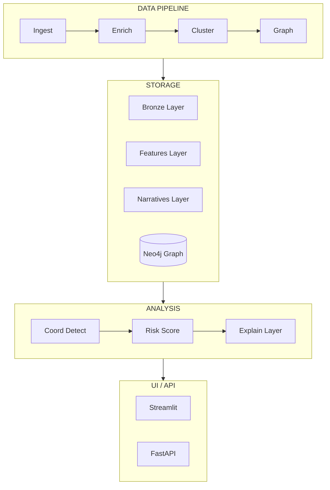

# Narrative Graph Intelligence Documentation

This section contains the technical documentation for the project.

## Index

1. [Architecture](./architecture.md) - System overview
2. [Data Pipeline](./data-pipeline.md) - Data processing flow
3. [Graph Model](./graph-model.md) - Neo4j graph structure
4. [Coordination Detection](./coordination-detection.md) - Detection algorithms
5. [Risk Engine](./risk-engine.md) - Scoring system
6. [API Reference](./api-reference.md) - Endpoint documentation
7. [Configuration Guide](./configuration.md) - Configuration options
8. [Command Reference](./commands.md) - Quick command reference

## High-Level Diagram

## Technology Stack

| Component | Technology |
|-----------|------------|
| Language | Python 3.11+ |
| Graph Database | Neo4j 5.x |
| Embeddings | sentence-transformers / OpenAI |
| Clustering | HDBSCAN / KMeans |
| NER | spaCy |
| UI | Streamlit |
| API | FastAPI |
| Storage | Parquet + SQLite |
| CLI | Typer |
