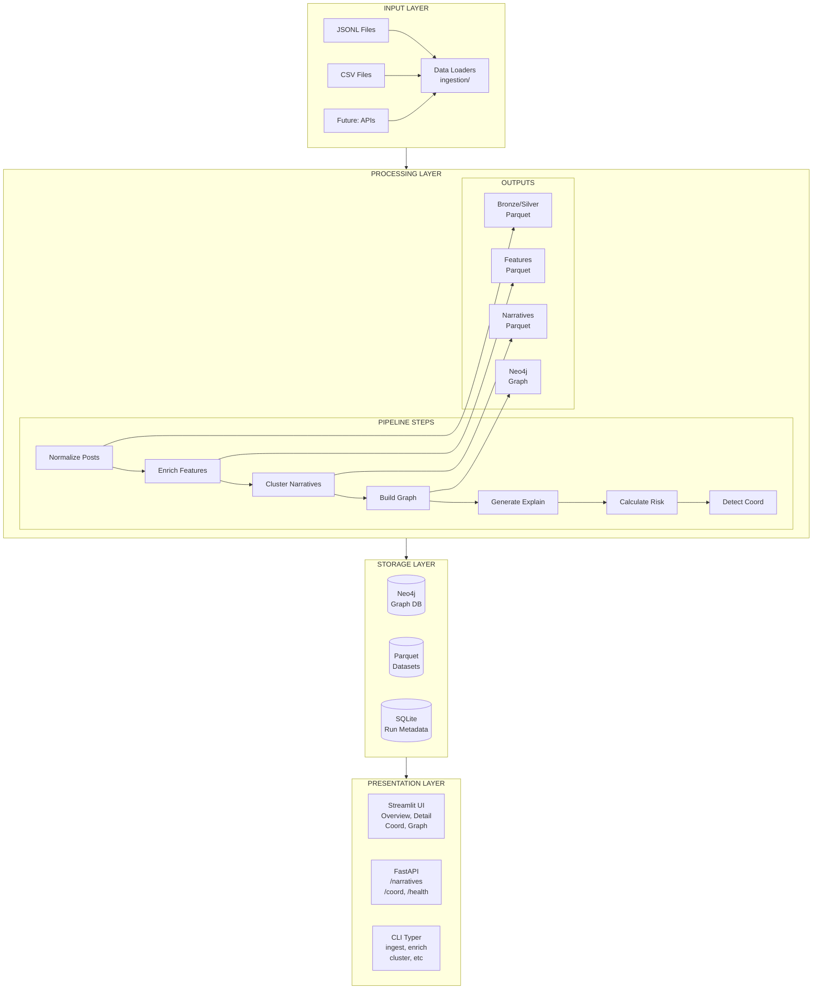
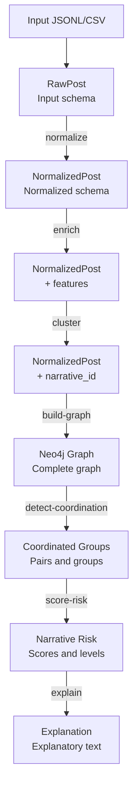

# System Architecture

## Overview

Narrative Graph Intelligence is a narrative analysis system designed to detect coordination patterns and assess risks in social media content. The architecture follows a modular pipeline pattern where each stage processes and enriches data.

## Architecture Diagram



## Main Components

### 1. Ingestion Module (`ingestion/`)

Responsible for loading and normalizing data from different sources.

```
ingestion/
├── loaders.py      # JSONL/CSV loaders
├── normalizer.py   # Bronze → Silver normalization
└── schemas.py      # Pydantic models
```

**Responsibilities:**
- Load data from JSONL and CSV files
- Validate schemas with Pydantic
- Normalize platforms, timestamps, URLs
- Handle errors with dead-letter queue

### 2. Features Module (`features/`)

Extracts features and entities from posts.

```
features/
├── text.py         # Text cleaning, language detection
├── extractors.py   # URL, hashtag, mention extraction
└── entities.py     # NER with spaCy (pluggable)
```

**Responsibilities:**
- Clean and normalize text
- Detect language
- Extract named entities
- Calculate numerical features

### 3. Narratives Module (`narratives/`)

Detects narratives through semantic clustering.

```
narratives/
├── embeddings.py   # Embedding generation
├── clustering.py   # HDBSCAN/KMeans
└── keywords.py     # TF-IDF extraction
```

**Responsibilities:**
- Generate text embeddings
- Cluster posts into narratives
- Extract representative keywords
- Assign metadata to narratives

### 4. Graph Module (`graph/`)

Builds and queries the graph in Neo4j.

```
graph/
├── connection.py   # Neo4j connection pool
├── builder.py      # Graph constructor
├── queries.py      # Predefined Cypher queries
├── metrics.py      # Centrality calculation
└── export.py       # GraphML/JSON export
```

**Responsibilities:**
- Manage Neo4j connections
- Create nodes and relationships in batch
- Calculate graph metrics
- Export subgraphs

### 5. Coordination Module (`coordination/`)

Detects coordinated behavior between accounts.

```
coordination/
├── detector.py     # Detection algorithms
└── evidence.py     # Evidence generation
```

**Responsibilities:**
- Detect text similarity between posts
- Identify temporal proximity
- Find shared indicators
- Group coordinated accounts

### 6. Risk Module (`risk/`)

Calculates risk scores for narratives.

```
risk/
├── engine.py       # Scoring engine
└── components.py   # Individual components
```

**Responsibilities:**
- Calculate posting velocity
- Measure coordination density
- Detect bot-like patterns
- Evaluate foreign domain ratio
- Combine scores with configurable weights

### 7. Explanations Module (`explain/`)

Generates auditable explanations.

```
explain/
├── llm.py          # LLM explanations
└── fallback.py     # Template-based explanations
```

**Responsibilities:**
- Generate grounded prompts
- Produce non-hallucinatory explanations
- Cite specific evidence
- Fallback without LLM

## Data Flow



## Design Patterns

### 1. Pipeline Pattern
Each pipeline step is independent and produces outputs that the next step consumes.

### 2. Repository Pattern
Storage modules (`database.py`, `parquet.py`) abstract persistence.

### 3. Strategy Pattern
Entity extractors and embedding providers are interchangeable.

### 4. Factory Pattern
`get_entity_extractor()` and `get_embedding_provider()` create instances based on configuration.

## Scalability Considerations

1. **Batch Processing**: All Neo4j operations use UNWIND for batch insertions.

2. **Lazy Loading**: ML models (spaCy, sentence-transformers) are loaded on demand.

3. **Streaming**: Loaders use generators to avoid loading everything into memory.

4. **Indexes**: Neo4j has constraints and indexes for efficient queries.

5. **Parquet**: Efficient columnar format for large datasets.

## Extensibility

The system is designed to be extensible:

- **New data sources**: Implement new loader in `ingestion/`
- **New extractors**: Implement `EntityExtractor` interface
- **New embeddings**: Implement `EmbeddingProvider` interface
- **New clustering algorithms**: Add in `narratives/clustering.py`
- **New risk components**: Add in `risk/components.py`
