# Coordination Detection

## Overview

The coordination detection module identifies synchronized behavior between accounts that could indicate coordinated influence operations or astroturfing campaigns.

## Architecture

```mermaid
flowchart TD
    subgraph Input
        Posts[Posts + Embeddings]
    end
    
    Posts --> Group[Group Posts by Narrative]
    Group --> Compare[Compare Author Pairs]
    
    subgraph Signals["Signal Calculation"]
        Text[Text Similarity<br/>0.5 weight]
        Domains[Shared Domains<br/>0.3 weight]
        Hashtags[Shared Hashtags<br/>0.2 weight]
    end
    
    Compare --> Text
    Compare --> Domains
    Compare --> Hashtags
    
    Text --> Weighted[Weighted Score]
    Domains --> Weighted
    Hashtags --> Weighted
    
    Weighted --> Filter[Filter by Threshold<br/>≥ 0.85]
    Filter --> BuildGraph[Build Coordination Graph<br/>Pairs]
    BuildGraph --> Components[Find Connected Components<br/>Groups]
    
    subgraph Output
        Pairs[Coordinated Pairs]
        Groups[Coordinated Groups]
        Evidence[Evidence]
    end
    
    Components --> Pairs
    Components --> Groups
    Components --> Evidence
```



## Coordination Signals

### 1. Text Similarity

Measures how similar the texts of posts from different authors are.

```python
# Calculation using embeddings
from sklearn.metrics.pairwise import cosine_similarity

emb1 = embeddings[post1_idx].reshape(1, -1)
emb2 = embeddings[post2_idx].reshape(1, -1)
text_similarity = cosine_similarity(emb1, emb2)[0, 0]
```

**Interpretation:**
- `> 0.95`: Nearly identical posts (copy-paste)
- `0.85 - 0.95`: Very similar posts (same message, different words)
- `0.70 - 0.85`: Thematically related posts
- `< 0.70`: Different posts

### 2. Shared Domains

Measures the overlap of shared web domains.

```python
shared_domains = set(post1.domains) & set(post2.domains)
total_domains = set(post1.domains) | set(post2.domains)
domain_similarity = len(shared_domains) / max(len(total_domains), 1)
```

**Interpretation:**
- Sharing uncommon domains is more significant
- Mainstream news domains are less indicative
- Propaganda/disinformation domains are more significant

### 3. Shared Hashtags

Measures the overlap of used hashtags.

```python
shared_hashtags = set(post1.hashtags) & set(post2.hashtags)
total_hashtags = set(post1.hashtags) | set(post2.hashtags)
hashtag_similarity = len(shared_hashtags) / max(len(total_hashtags), 1)
```

**Interpretation:**
- Campaign-specific hashtags are more indicative
- Generic trending hashtags are less indicative

### 4. Temporal Proximity

Only posts within a time window are considered.

```python
time_diff = abs((post1.timestamp - post2.timestamp).total_seconds())
is_proximate = time_diff <= time_window.total_seconds()
```

**Configuration:**
```yaml
coordination:
  time_window_minutes: 60  # 1 hour window
```

## Coordination Score

### Formula

```python
coordination_score = (
    text_weight * text_similarity +
    domain_weight * domain_similarity +
    hashtag_weight * hashtag_similarity
)
```

### Default Weights

```yaml
coordination:
  text_similarity_weight: 0.5    # 50%
  shared_domain_weight: 0.3      # 30%
  shared_hashtag_weight: 0.2     # 20%
```

### Threshold

```yaml
coordination:
  similarity_threshold: 0.85  # Minimum score to consider coordination
```

## Detection Algorithm

### Step 1: Group by Narrative

```python
narrative_posts = defaultdict(list)
for post in posts:
    if post.narrative_id and post.narrative_id != "noise":
        narrative_posts[post.narrative_id].append(post)
```

### Step 2: Compare Author Pairs

```python
for narrative_id, posts in narrative_posts.items():
    # Group posts by author
    author_posts = defaultdict(list)
    for post in posts:
        author_posts[post.author_id].append(post)
    
    # Compare each pair of authors
    authors = list(author_posts.keys())
    for i, author1 in enumerate(authors):
        for author2 in authors[i+1:]:
            score, evidence = calculate_pair_score(
                author_posts[author1],
                author_posts[author2],
                embeddings
            )
            if score >= threshold:
                pairs.append(CoordinatedPair(...))
```

### Step 3: Build Groups

We use BFS to find connected components:


```python
def build_groups(pairs):
    # Build adjacency graph
    graph = defaultdict(set)
    for pair in pairs:
        graph[pair.author1_id].add(pair.author2_id)
        graph[pair.author2_id].add(pair.author1_id)
    
    # BFS to find components
    visited = set()
    groups = []
    
    for start in graph:
        if start in visited:
            continue
        
        component = []
        queue = [start]
        
        while queue:
            node = queue.pop(0)
            if node in visited:
                continue
            visited.add(node)
            component.append(node)
            queue.extend(graph[node] - visited)
        
        if len(component) >= min_group_size:
            groups.append(component)
    
    return groups
```

## Evidence

### Evidence Structure

```python
class CoordinationEvidence(BaseModel):
    post_ids: list[str]           # Involved posts
    shared_domains: list[str]     # Shared domains
    shared_hashtags: list[str]    # Shared hashtags
    text_similarity: float        # Maximum text similarity
    time_delta_seconds: float     # Time difference
```

### Summary Generation

```python
def generate_evidence_summary(pairs, groups):
    return {
        "total_pairs": len(pairs),
        "total_groups": len(groups),
        "top_groups": [...],
        "most_coordinated_authors": [...],
        "shared_indicators": {
            "domains": {...},
            "hashtags": {...}
        }
    }
```

## Neo4j Storage

### COORDINATED_WITH Relationship

```cypher
UNWIND $batch AS item
MATCH (a1:Author {id: item.author1_id})
MATCH (a2:Author {id: item.author2_id})
WHERE a1.id < a2.id  -- Avoid duplicates
MERGE (a1)-[r:COORDINATED_WITH]-(a2)
SET r.score = item.score,
    r.evidence = item.evidence,
    r.narrative_id = item.narrative_id
```

### Update Author Scores

```cypher
MATCH (a:Author)-[r:COORDINATED_WITH]-()
WITH a, avg(r.score) as avg_score, count(r) as coord_count
SET a.coordination_score = avg_score,
    a.coordination_count = coord_count
```

## Analysis Queries

### Find Coordinated Groups

```cypher
MATCH (a1:Author)-[r:COORDINATED_WITH]-(a2:Author)
WHERE r.score >= 0.85
WITH a1, collect({
    author: a2.id,
    score: r.score
}) as connections
WHERE size(connections) >= 2
RETURN a1.id, a1.handle, connections
ORDER BY size(connections) DESC
```

### Coordination by Narrative

```cypher
MATCH (a1:Author)-[r:COORDINATED_WITH]-(a2:Author)
WHERE r.narrative_id = $narrative_id
RETURN a1.id, a2.id, r.score, r.evidence
```

### Most Coordinated Authors

```cypher
MATCH (a:Author)
WHERE a.coordination_count > 0
RETURN a.id, a.handle, 
       a.coordination_score, 
       a.coordination_count
ORDER BY a.coordination_count DESC
LIMIT 20
```

## Limitations and Considerations

### False Positives

1. **Viral news**: Many users may legitimately share the same news
2. **Trending hashtags**: Organic use of popular hashtags
3. **Quotes and retweets**: Naturally shared content

### False Negatives

1. **Sophisticated coordination**: Use of paraphrasing to avoid detection
2. **Randomized timing**: Intentional delays between posts
3. **Compartmentalized accounts**: Groups that don't interact directly

### Mitigations

1. **Contextual analysis**: Consider the narrative context
2. **Behavior baseline**: Compare with normal patterns
3. **Manual review**: Results should be reviewed by analysts

## Recommended Configuration

### For Sensitive Detection (more false positives)

```yaml
coordination:
  time_window_minutes: 120
  similarity_threshold: 0.75
  min_group_size: 2
```

### For Specific Detection (fewer false positives)

```yaml
coordination:
  time_window_minutes: 30
  similarity_threshold: 0.90
  min_group_size: 4
```

### Balanced (default)

```yaml
coordination:
  time_window_minutes: 60
  similarity_threshold: 0.85
  min_group_size: 3
```
