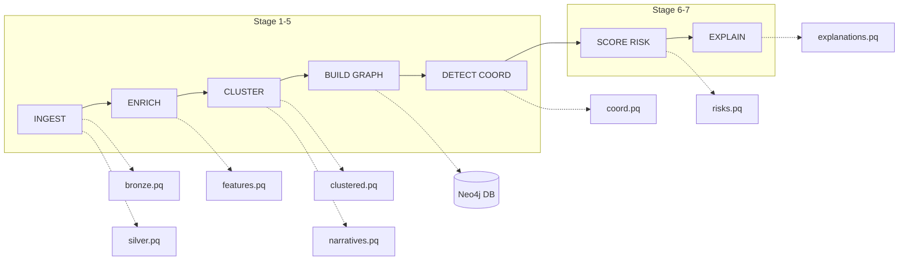
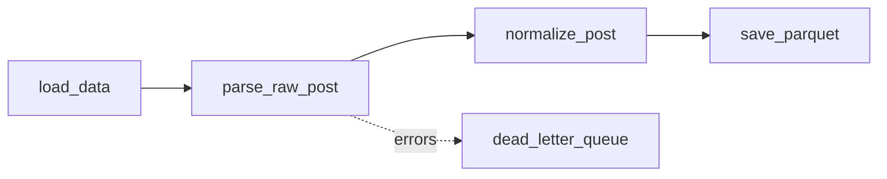
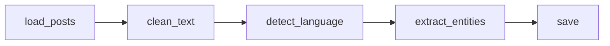
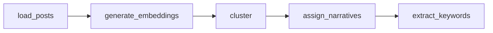
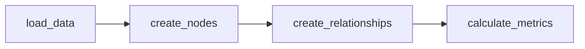
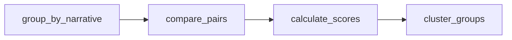
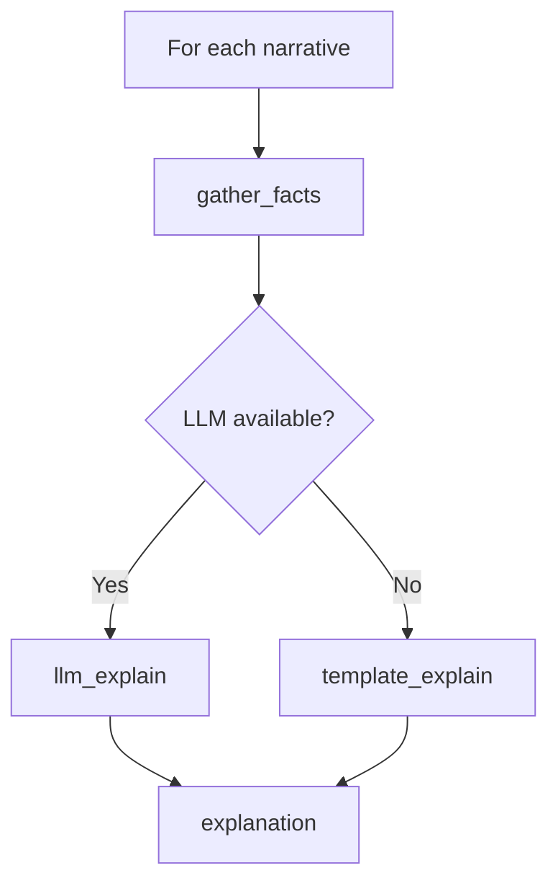

# Data Pipeline

## Overview

The data pipeline processes information from ingestion to insight generation. Each stage is idempotent and produces outputs versioned by `run_id`.

## Pipeline Stages



## 1. Ingestion (`ingest`)

### Input
- JSONL or CSV file with posts

### Process



### Output
- `outputs/{run_id}/bronze.parquet` - Raw data
- `outputs/{run_id}/silver.parquet` - Normalized data

### Input Schema

```json
{
  "id": "string (required)",
  "timestamp": "ISO8601 string (required)",
  "platform": "string (required)",
  "author_id": "string (required)",
  "author_handle": "string (optional)",
  "text": "string (required)",
  "lang": "string (optional)",
  "urls": ["array of strings (optional)"],
  "hashtags": ["array of strings (optional)"],
  "mentions": ["array of strings (optional)"],
  "metadata": {"object (optional)"}
}
```

### Transformations
1. **Timestamp**: Parse to datetime (supports multiple formats)
2. **Platform**: Normalization (twitter, x → TWITTER)
3. **URLs**: Extraction from text + explicit list
4. **Domains**: Extraction from URLs
5. **Hashtags**: Extraction from text + explicit list
6. **Mentions**: Extraction from text + explicit list

### Dead Letter Queue
Failed records are saved in SQLite with:
- `raw_payload`: Original JSON
- `error_type`: Error type
- `error_message`: Description
- `source_file`: Source file
- `line_number`: Error line

---

## 2. Enrichment (`enrich`)

### Input
- `silver.parquet`

### Process



### Output
- `outputs/{run_id}/features.parquet` - Posts with features
- `outputs/{run_id}/entities.parquet` - Extracted entities

### Extracted Features
| Feature | Description |
|---------|-------------|
| `text_clean` | Text without URLs or mentions |
| `lang` | Detected language code |
| `text_length` | Text length |
| `url_count` | Number of URLs |
| `hashtag_count` | Number of hashtags |
| `mention_count` | Number of mentions |

### Entities (NER)
Supported types:
- `PERSON` - People
- `ORG` - Organizations
- `GPE` - Geopolitical entities
- `LOC` - Locations
- `EVENT` - Events

---

## 3. Clustering (`cluster`)

### Input
- `features.parquet`

### Process



### Output
- `outputs/{run_id}/clustered.parquet` - Posts with narrative_id
- `outputs/{run_id}/narratives.parquet` - Narrative metadata

### Clustering Algorithms

#### HDBSCAN (default)
```yaml
clustering:
  algorithm: "hdbscan"
  min_cluster_size: 5
  min_samples: 3
  metric: "euclidean"
```

Advantages:
- No predefined number of clusters required
- Detects outliers (noise)
- Handles clusters of different densities

#### KMeans (alternative)
```yaml
clustering:
  algorithm: "kmeans"
  n_clusters: 10
  random_state: 42
```

Advantages:
- Faster
- More predictable results
- All posts assigned to a cluster

### Embeddings

#### sentence-transformers (default)
```yaml
embeddings:
  provider: "sentence-transformers"
  model: "all-MiniLM-L6-v2"
```

#### OpenAI (optional)
```yaml
embeddings:
  provider: "openai"
  openai_model: "text-embedding-3-small"
```

### Narrative Metadata
```python
NarrativeMetadata(
    id="narrative_0001",
    size=50,                    # Number of posts
    keywords=["policy", ...],   # Top TF-IDF keywords
    top_domains=["example.com"],
    top_hashtags=["PolicyChange"],
    start_time=datetime(...),
    end_time=datetime(...),
    platforms=["twitter"],
    author_count=15
)
```

---

## 4. Graph Building (`build-graph`)

### Input
- `clustered.parquet`
- `narratives.parquet`
- `entities.parquet` (optional)

### Process



### Output
- Graph in Neo4j

### Batch Operations
All insertions use `UNWIND` for efficiency:

```cypher
UNWIND $batch AS item
MERGE (p:Post {id: item.id})
SET p.text = item.text, ...
```

### Created Nodes
| Type | Properties |
|------|------------|
| Author | id, handle, platform, post_count |
| Post | id, text, timestamp, platform, lang |
| Narrative | id, size, keywords, risk_score |
| Domain | name, post_count |
| Hashtag | tag, post_count |
| Entity | name, type, mention_count |

### Created Relationships
| Type | Source → Target |
|------|-----------------|
| POSTED | Author → Post |
| BELONGS_TO | Post → Narrative |
| LINKS_TO | Post → Domain |
| TAGGED_WITH | Post → Hashtag |
| MENTIONS | Post → Entity |

---

## 5. Coordination Detection (`detect-coordination`)

### Input
- `clustered.parquet` (with embeddings)
- Neo4j graph

### Process



### Output
- `outputs/{run_id}/coordination_pairs.parquet`
- `outputs/{run_id}/coordination_groups.parquet`
- `COORDINATED_WITH` relationships in Neo4j

### Coordination Signals
| Signal | Weight (default) | Description |
|--------|------------------|-------------|
| Text Similarity | 0.5 | Cosine similarity of embeddings |
| Shared Domains | 0.3 | Shared domains |
| Shared Hashtags | 0.2 | Shared hashtags |

### Parameters
```yaml
coordination:
  time_window_minutes: 60      # Time window
  similarity_threshold: 0.85   # Similarity threshold
  min_group_size: 3            # Minimum group size
```

### Grouping Algorithm
1. Build graph of coordinated pairs
2. Find connected components (BFS)
3. Filter by minimum size
4. Calculate group average score

---

## 6. Risk Scoring (`score-risk`)

### Input
- `clustered.parquet`
- `narratives.parquet`
- `coordination_groups.parquet`

### Process
```python
# Scoring flow
for narrative in narratives:
    components = calculate_components(narrative)
    score = weighted_sum(components)
    level = classify(score)
```

### Output
- `outputs/{run_id}/risks.parquet`
- Update of Narrative nodes in Neo4j

### Risk Components
| Component | Weight | Description |
|-----------|--------|-------------|
| velocity | 0.25 | Posts per hour |
| coordination_density | 0.30 | Ratio of coordinated accounts |
| bot_score | 0.20 | Bot-like patterns |
| foreign_domain_ratio | 0.15 | Foreign domain ratio |
| toxicity | 0.10 | Toxicity indicators |

### Classification
```yaml
risk:
  thresholds:
    low: 0.3      # score < 0.3 → LOW
    medium: 0.6   # 0.3 ≤ score < 0.6 → MEDIUM
    high: 0.8     # score ≥ 0.6 → HIGH
```

---

## 7. Explanation Generation (`explain`)

### Input
- `narratives.parquet`
- `risks.parquet`

### Process



### Output
- `outputs/{run_id}/explanations.parquet`
- Update of Narrative nodes in Neo4j

### Explanation Modes

#### LLM (OpenAI)
- Grounded prompt with facts
- Non-hallucinatory (only uses provided facts)
- Cites specific evidence

#### Template (Fallback)
- Rule-based
- No API key required
- Generates structured text

### Explanation Schema
```python
Explanation(
    target_id="narrative_0001",
    target_type="narrative",
    explanation_text="This narrative...",
    facts_used={"size": 50, ...},
    model_info="gpt-4o-mini",
    generated_at=datetime(...)
)
```

---

## Run Management

### Run ID
Each execution has a unique identifier:
```
run_abc123def456
```

### Output Structure
```
outputs/
└── run_abc123def456/
    ├── manifest.json      # Run metadata
    ├── bronze.parquet
    ├── silver.parquet
    ├── features.parquet
    ├── entities.parquet
    ├── clustered.parquet
    ├── narratives.parquet
    ├── coordination_pairs.parquet
    ├── coordination_groups.parquet
    ├── risks.parquet
    └── explanations.parquet
```

### Manifest
```json
{
  "run_id": "run_abc123def456",
  "started_at": "2024-01-15T10:00:00",
  "completed_at": "2024-01-15T10:05:00",
  "status": "completed",
  "input_file": "data/sample.jsonl",
  "input_hash": "a1b2c3d4e5f6",
  "config_hash": "f6e5d4c3b2a1",
  "steps_completed": ["ingest", "enrich", ...],
  "dead_letter_count": 0
}
```

### Idempotency
- Same input + config → same output
- Fixed seeds for clustering
- Deterministic timestamps
