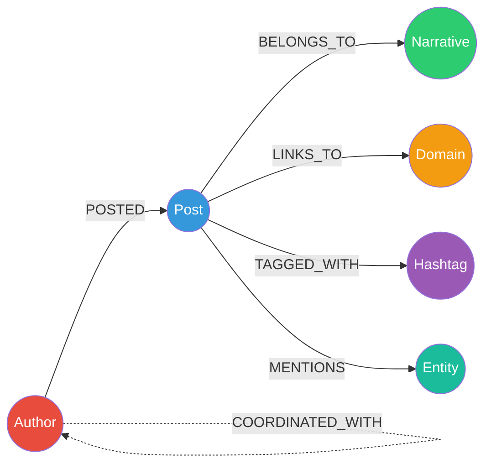
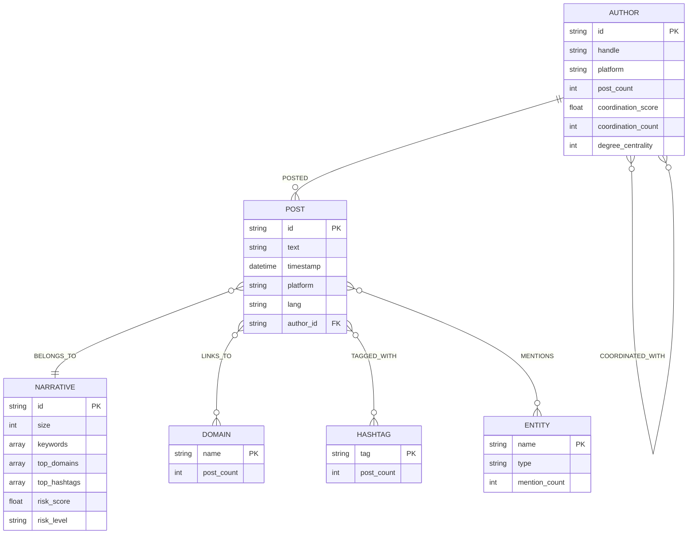

# Neo4j Graph Model

## Overview

The graph captures relationships between authors, posts, narratives, and other elements of the information ecosystem.

## Model Diagram



## Entity Relationship Diagram



## Nodes

### Author
Represents an account or content author.

```cypher
(:Author {
    id: "user_001",           // Unique identifier
    handle: "@username",      // Handle/username
    platform: "twitter",      // Platform
    post_count: 15,           // Number of posts
    coordination_score: 0.75, // Coordination score
    coordination_count: 3,    // Number of coordinated connections
    degree_centrality: 10,    // Degree centrality
    updated_at: datetime()    // Last update
})
```

**Indexes:**
```cypher
CREATE CONSTRAINT author_id IF NOT EXISTS 
FOR (a:Author) REQUIRE a.id IS UNIQUE;

CREATE INDEX author_platform IF NOT EXISTS 
FOR (a:Author) ON (a.platform);
```

### Post
Represents an individual post or publication.

```cypher
(:Post {
    id: "post_001",                    // Unique identifier
    text: "Content of the post...",    // Post text
    timestamp: datetime(),              // Timestamp
    platform: "twitter",               // Platform
    lang: "en",                        // Language
    author_id: "user_001",             // Author reference
    created_at: datetime()             // Graph creation date
})
```

**Indexes:**
```cypher
CREATE CONSTRAINT post_id IF NOT EXISTS 
FOR (p:Post) REQUIRE p.id IS UNIQUE;

CREATE INDEX post_timestamp IF NOT EXISTS 
FOR (p:Post) ON (p.timestamp);

CREATE INDEX post_platform IF NOT EXISTS 
FOR (p:Post) ON (p.platform);
```

### Narrative
Represents a cluster of posts about a common topic.

```cypher
(:Narrative {
    id: "narrative_0001",              // Unique identifier
    size: 50,                          // Number of posts
    keywords: ["policy", "change"],    // TF-IDF keywords
    top_domains: ["example.com"],      // Top domains
    top_hashtags: ["PolicyChange"],    // Top hashtags
    start_time: datetime(),            // Period start
    end_time: datetime(),              // Period end
    velocity: 5.2,                     // Posts per hour
    risk_score: 0.75,                  // Risk score
    risk_level: "HIGH",                // Risk level
    risk_components: "{}",             // JSON with components
    explanation: "This narrative...",  // Generated explanation
    created_at: datetime()             // Creation date
})
```

**Indexes:**
```cypher
CREATE CONSTRAINT narrative_id IF NOT EXISTS 
FOR (n:Narrative) REQUIRE n.id IS UNIQUE;

CREATE INDEX narrative_risk_score IF NOT EXISTS 
FOR (n:Narrative) ON (n.risk_score);
```

### Domain
Represents a web domain shared in posts.

```cypher
(:Domain {
    name: "example.com",    // Domain name
    post_count: 25          // Number of posts sharing it
})
```

**Indexes:**
```cypher
CREATE CONSTRAINT domain_name IF NOT EXISTS 
FOR (d:Domain) REQUIRE d.name IS UNIQUE;
```

### Hashtag
Represents a hashtag used in posts.

```cypher
(:Hashtag {
    tag: "policychange",    // Hashtag (lowercase)
    post_count: 30          // Number of posts using it
})
```

**Indexes:**
```cypher
CREATE CONSTRAINT hashtag_tag IF NOT EXISTS 
FOR (h:Hashtag) REQUIRE h.tag IS UNIQUE;
```

### Entity
Represents a named entity extracted from text.

```cypher
(:Entity {
    name: "John Doe",       // Entity name
    type: "PERSON",         // Type (PERSON, ORG, GPE, etc.)
    mention_count: 10       // Number of mentions
})
```

**Indexes:**
```cypher
CREATE CONSTRAINT entity_name_type IF NOT EXISTS 
FOR (e:Entity) REQUIRE (e.name, e.type) IS UNIQUE;
```

## Relationships

### POSTED
Connects an Author with their Posts.

```cypher
(a:Author)-[:POSTED {
    timestamp: datetime()    // Post timestamp
}]->(p:Post)
```

### BELONGS_TO
Connects a Post with its Narrative.

```cypher
(p:Post)-[:BELONGS_TO {
    similarity_score: 0.92   // Cluster similarity score
}]->(n:Narrative)
```

### LINKS_TO
Connects a Post with the Domains it references.

```cypher
(p:Post)-[:LINKS_TO]->(d:Domain)
```

### TAGGED_WITH
Connects a Post with the Hashtags it uses.

```cypher
(p:Post)-[:TAGGED_WITH]->(h:Hashtag)
```

### MENTIONS
Connects a Post with the Entities it mentions.

```cypher
(p:Post)-[:MENTIONS]->(e:Entity)
```

### COORDINATED_WITH
Connects Authors that show coordinated behavior.

```cypher
(a1:Author)-[:COORDINATED_WITH {
    score: 0.85,                    // Coordination score
    evidence: "{}",                 // JSON with evidence
    narrative_id: "narrative_0001"  // Related narrative
}]-(a2:Author)
```

**Note:** This relationship is bidirectional (no specific direction).

## Example Queries

### Get all narratives ordered by risk

```cypher
MATCH (n:Narrative)
OPTIONAL MATCH (p:Post)-[:BELONGS_TO]->(n)
WITH n, count(p) as post_count
RETURN n {
    .id, .size, .keywords, .risk_score, .risk_level,
    post_count: post_count
}
ORDER BY n.risk_score DESC
```

### Get narrative details

```cypher
MATCH (n:Narrative {id: $narrative_id})
OPTIONAL MATCH (p:Post)-[:BELONGS_TO]->(n)
OPTIONAL MATCH (p)-[:TAGGED_WITH]->(h:Hashtag)
OPTIONAL MATCH (p)-[:LINKS_TO]->(d:Domain)
OPTIONAL MATCH (a:Author)-[:POSTED]->(p)
WITH n, 
     collect(DISTINCT p) as posts,
     collect(DISTINCT h.tag) as hashtags,
     collect(DISTINCT d.name) as domains,
     collect(DISTINCT a) as authors
RETURN n {
    .id, .size, .keywords, .risk_score, .risk_level, .explanation,
    post_count: size(posts),
    hashtags: hashtags,
    domains: domains,
    author_count: size(authors)
}
```

### Top amplifiers of a narrative

```cypher
MATCH (a:Author)-[:POSTED]->(p:Post)-[:BELONGS_TO]->(n:Narrative {id: $narrative_id})
WITH a, count(p) as post_count
RETURN a {
    .id, .handle, .platform, .coordination_score,
    post_count: post_count
}
ORDER BY post_count DESC
LIMIT 10
```

### Coordinated groups

```cypher
MATCH (a1:Author)-[r:COORDINATED_WITH]-(a2:Author)
WHERE r.score >= $min_score
WITH a1, collect({
    author: a2, 
    score: r.score, 
    evidence: r.evidence
}) as connections
WHERE size(connections) >= $min_group_size - 1
RETURN a1 {
    .id, .handle, .platform,
    connections: connections
}
ORDER BY size(connections) DESC
```

### Narrative subgraph

```cypher
MATCH (n:Narrative {id: $narrative_id})
OPTIONAL MATCH (p:Post)-[:BELONGS_TO]->(n)
OPTIONAL MATCH (a:Author)-[:POSTED]->(p)
OPTIONAL MATCH (p)-[:LINKS_TO]->(d:Domain)
OPTIONAL MATCH (p)-[:TAGGED_WITH]->(h:Hashtag)
OPTIONAL MATCH (p)-[:MENTIONS]->(e:Entity)
RETURN n, collect(DISTINCT p) as posts, 
       collect(DISTINCT a) as authors,
       collect(DISTINCT d) as domains,
       collect(DISTINCT h) as hashtags,
       collect(DISTINCT e) as entities
```

## Graph Metrics

### Degree Centrality

```cypher
MATCH (a:Author)-[:POSTED]->(p:Post)
WITH a, count(p) as degree
SET a.degree_centrality = degree
RETURN count(a) as updated
```

### Narrative Velocity

```cypher
MATCH (p:Post)-[:BELONGS_TO]->(n:Narrative)
WITH n, 
     min(p.timestamp) as start_time,
     max(p.timestamp) as end_time,
     count(p) as post_count
WITH n, post_count,
     duration.between(start_time, end_time).hours as hours
SET n.velocity = CASE 
    WHEN hours > 0 THEN toFloat(post_count) / hours 
    ELSE toFloat(post_count) 
END
RETURN count(n) as updated
```

### Graph Statistics

```cypher
// Node count by type
CALL db.labels() YIELD label
CALL apoc.cypher.run(
    'MATCH (n:`' + label + '`) RETURN count(n) as count', 
    {}
) YIELD value
RETURN label, value.count as count

// Relationship count by type
CALL db.relationshipTypes() YIELD relationshipType
RETURN relationshipType, count(*) as count
```

## Export

### To JSON

```cypher
MATCH (n:Narrative {id: $narrative_id})
OPTIONAL MATCH path = (n)<-[:BELONGS_TO]-(p:Post)<-[:POSTED]-(a:Author)
WITH collect(path) as paths
CALL apoc.export.json.data(
    [node in paths | nodes(node)],
    [rel in paths | relationships(rel)],
    null,
    {stream: true}
)
YIELD data
RETURN data
```

### To GraphML

```cypher
CALL apoc.export.graphml.query(
    "MATCH (n:Narrative {id: $id})<-[:BELONGS_TO]-(p:Post) RETURN n, p",
    "/exports/narrative.graphml",
    {params: {id: $narrative_id}}
)
```

## Optimization

### Recommended Indexes

```cypher
// Already created by init_schema()
CREATE CONSTRAINT author_id FOR (a:Author) REQUIRE a.id IS UNIQUE;
CREATE CONSTRAINT post_id FOR (p:Post) REQUIRE p.id IS UNIQUE;
CREATE CONSTRAINT narrative_id FOR (n:Narrative) REQUIRE n.id IS UNIQUE;
CREATE CONSTRAINT domain_name FOR (d:Domain) REQUIRE d.name IS UNIQUE;
CREATE CONSTRAINT hashtag_tag FOR (h:Hashtag) REQUIRE h.tag IS UNIQUE;

CREATE INDEX post_timestamp FOR (p:Post) ON (p.timestamp);
CREATE INDEX post_platform FOR (p:Post) ON (p.platform);
CREATE INDEX narrative_risk FOR (n:Narrative) ON (n.risk_score);
```

### Batch Operations

Always use `UNWIND` for batch operations:

```cypher
// Good ✓
UNWIND $batch AS item
MERGE (p:Post {id: item.id})
SET p.text = item.text

// Bad ✗
// Multiple individual queries
```

### Memory Settings

For large datasets, adjust in `docker-compose.yml`:

```yaml
environment:
  - NEO4J_server_memory_heap_initial__size=512m
  - NEO4J_server_memory_heap_max__size=2G
  - NEO4J_server_memory_pagecache_size=1G
```
